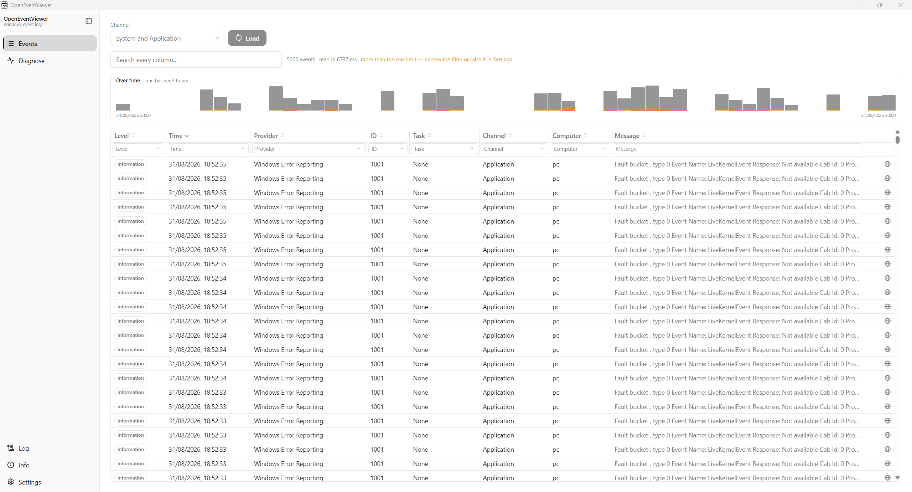

# OpenEventViewer

A Windows desktop app that reads the Windows event logs and filters them down to what matters.

The built-in Event Viewer can answer most of these questions, eventually. This one is built around
the two things that actually take the time: narrowing fifty thousand records to the dozen that
matter, and seeing when they happened.



- **Events** — a virtualised table over up to 50 000 records. Per-column filters that fit each
  column: tick lists with a search box and a count for level, provider, task, channel and computer;
  a from/to range for the time; an expression for the ID (`41, 6008`, `>7000`, `7000-7040`,
  `!10016`); free text for the message. One keyword box searches every column at once. Columns are
  draggable and remember their width.
- **A bar chart over time** above the table, showing whatever the filters currently leave. Hovering
  a bar says which errors are under it, grouped and counted.
- **Diagnose** — scans the log for the events a machine writes when something went wrong (unexpected
  shutdown, bug check, hardware error, application hang or crash, service failure, disk, NTFS,
  display driver reset, processor throttling) and pulls the quarter of an hour around one of them.

## What it does not do

- **It does not write to the event log.** It queries, and that is all. No clearing a channel, no
  archiving one, no changing its size.
- **It has no account, no API key and no model.** Nothing is sent anywhere on its own. Two things
  reach the network, both started by a person: the update check at start, and the web search a
  row's own button opens in the default browser.
- **It collects no telemetry.**

## Reading the Security channel

Windows lets only an elevated process read it. OpenEventViewer ships without a
`requireAdministrator` manifest on purpose — it is useful without elevation, and asking every user
for it to read one channel they mostly do not want is the wrong trade. Pick Security and the app
says what is missing rather than showing an empty table; start it as administrator and it reads.

## Installing

Download the `-setup.exe` from the [releases page][releases] and run it. It is an NSIS installer
and needs no administrator rights.

SmartScreen will warn on the first install: the app carries a minisign signature, not an
Authenticode one. That is what makes _updates_ verifiable for free — a code-signing certificate is
a separate, paid thing this project does not have. Updates after the first install are checked
against the signature and are refused if it does not match.

[releases]: https://github.com/thorstenalpers/OpenEventViewer/releases

## Building

Needs Node 24 and a Rust toolchain with the MSVC target. Windows only — the event log is the
product, not an incidental host.

```bash
npm ci
npm run start        # the app itself, in the Tauri window
npm run dev          # the UI alone in a browser, against a mock host
npm run app:build    # NSIS installer + updater artifacts
```

`npm run dev` needs neither Tauri nor a Windows event log: a seeded generator stands in for the
host, so every page can be built and tested in a plain browser.

## Checks

```bash
npm run lint && npm run check && npm test
cargo fmt --all -- --check && cargo clippy --workspace --all-targets -- -D warnings
cargo test --workspace
```

The tests that read this machine's own event log are `#[ignore]`d, because a fresh CI runner has
nothing useful in its log and a green tick there would mean nothing:

```bash
cargo test --manifest-path src-tauri/Cargo.toml -- --ignored
```

## Built on

Tauri 2 and Rust for the host, reading the log through the `windows` crate (`EvtQuery`, `EvtNext`,
`EvtRender`, `EvtFormatMessage`) and parsing each event's XML with `roxmltree`. SvelteKit with
Svelte 5 runes and Tailwind v4 for the interface, TanStack Table for the table with hand-rolled
windowing, and Zod for one declaration of every command the two sides exchange.

Everything Win32 lives in one file behind a safe wrapper; everything that decides anything — a
filter to an XPath, XML to a record, the incident signatures — is a pure function with a test.

`AGENTS.md` holds the conventions this repository is written to.

## Licence

MIT. The third-party notices ship inside the installer as `THIRD_PARTY_LICENSES.txt`, regenerated
by `npm run licenses`.
